# Summary

The Python package `HomoPy` is a numerical software tool which provides computational methods in the field of continuum mechanics with a specific emphasize on fiber reinforced composites. The key element of `HomoPy` is the calculation and visualization of effective elastic stiffness properties of hybrid materials, i.e. multi-inclusion composites, using homogenization procedures. The current homogenization implementations are the conventional, three-dimensional Mori-Tanaka approach (cf. [@Mori1973]) in the formulation of [@Benveniste1987] with a possible orientation averaging scheme after Advani and Tucker (cf. [@Advani1987]). To circumvent effective stiffness tensors, which are not major-symmetric and therefore violate thermodynamical principles, the algorithm in [@Segura2023] was implemented and can be activated by a flag parameter to ensure symmetric stiffnesses. Alternatively, the shear-lag modified Halpin-Tsai approach (cf. [@Fu2019]) for purely planar information, for which the laminate theory is used to calculate effective stiffness properties, is available. The use field of these tools is academic research. An illustration of these schemes procedures is given in Fig. xy.

and referenced from text using \autoref{fig:example}.

Experimental research has shown that hybridization effects for multi-inclusion composites exist (cf. [@Summerscales1978], [@Fu1998] and [@Swolfs2014]), which raises the demand to have numerical methods at hand to predict the effective properties of such composites. With a multi-inclusion Mori-Tanaka approach and the laminate theory incorporating the shear-lag modified Halpin-Tsai approach, `HomoPy` provides a solution to this demand.

Furthermore, `HomoPy` has the functionality to visualize the effective stiffness properties following [@Boehlke2001], which allows for an intuitive comparison of different composites. The resulting effective properties can then used in consequent numerical simulations.

# Statement of need

Current ecological developments call for technical solutions to reduce the ecological footprint of future innovations. Significant opportunities to promote a better eco-balance lie in the development of new material systems, particularly in the area of lightweight construction. Fiber-reinforced polymers (FRP) are a promising class of materials in the field of lightweight construction. The fibers used have high specific strength and stiffness properties, so that less material is required to achieve comparable properties in comparison with conventional materials, e.g. steel. The polymer, hereafter referred to as the matrix, is used to hold the fibers in place and transfer stresses between them. Furthermore, ... .Further literature on FRP can be found in [@Christensen1980] and [@Chawla2019].

A general challenge in using FRP in engineering is that prediction simulations rely on robust material models. Since it is a highly inhomogeneous material, the computational cost increases dramatically if all components are modeled directly, i.e. when a full field simulation is used. To circumvent this, homogenization methods have been developed in recent decades. The goal of a homogenization method is to calculate the material properties of a synthetic homogeneous material, which should then effectively behave like the inhomogeneous material.

`HomoPy` was developed to implement two commonly used homogenization methods, namely the Mori-Tanka (cf. [@Mori1973]) for 3D stiffness predictions and a shear-lag modified Halpin-Tsai method (cf. [@Cox1952] and [@Halpin1969]) for planar predictions, i.e. laminate predictions. The goal of `HomoPy` is to provide an open-source implementation of these methods with a particular focus on FRP modeling. Other modules offering similar functionalities are available, e.g. `fiberpy` and `mechmean`, but to the author's knowledge none of them provides the capability to model hybrid FRPs consisting of different fiber materials and/or geometries. Furthermore, a major advantage in HomoPy is the implementation of the graphical representation of the effective directional stiffnesses according to [@Boehlke2001]. Comparing different material systems or FRP tape layup orientations is intuitively easier with a graphical representation than comparing up to 21 stiffness components each.

To this point, `HomoPy` is limited to calculating the effective elastic properties with the two methods mentioned above. Possible extensions for the future include thermal expansion properties and other homogenization methods.

# Acknowledgements

The research documented in this manuscript has been funded by the German Research Foundation (DFG) within the International Research Training Group “Integrated engineering of continuous-discontinuous long fiber-reinforced polymer structures” (GRK 2078/2). The support by the German Research Foundation (DFG) is gratefully acknowledged.

# References
